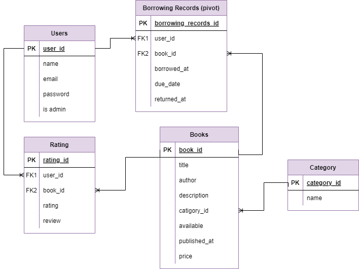

# Book Management System

## Description
This project is a **Book Management System** built with **Laravel 10** that provides a **RESTful API** for managing books. It allows users and administrators to perform various operations related to books and user interactions. Users can register, log in, log out, explore books, borrow books, and rate books. Administrators have additional privileges to manage books, book categories, users, and borrowing activities. The system follows incorporates **clean code** and **refactoring principles**.

### Key Features:
- **User Operations**:
  - **Registration**: Users can register an account.
  - **Login/Logout**: Users can log in and out of their accounts.
  - **Explore Books**: Users can browse and search for books by filters.
  - **Borrow Books**: Users can borrow books from the library.
  - **Rate Books**: Users can rate books they have borrowed.

- **Admin Operations**:
  - **CRUD for Books**: Administrators can create, read, update, and delete books.
  - **CRUD for Book Categories**: Administrators can manage book categories.
  - **Moderate Users**: Administrators can manage user accounts.
  - **Moderate Borrowing Books**: Administrators can oversee borrowing transactions.
  - **Moderate Ratings**: Administrators can review and manage book ratings.

- **Form Requests**: Validation is handled by custom form request classes.
- **API Response Service**: Unified responses for API endpoints.
- **Pagination**: Results are paginated for better performance and usability.
- **Resources**: API responses are formatted using Laravel resources for a consistent structure.
- **Seeders**: Populate the database with initial data for testing and development.

### Technologies Used:
- **Laravel 10**
- **PHP**
- **MySQL**
- **XAMPP** 
- **Composer** 
- **Postman Collection**: Contains all API requests for easy testing and interaction with the API.

---

## ERD



## Installation

### Prerequisites

Ensure you have the following installed on your machine:
- **XAMPP**: For running MySQL and Apache servers locally.
- **Composer**: For PHP dependency management.
- **PHP**: Required for running Laravel.
- **MySQL**: Database for the project.
- **Postman**: Required for testing the requests.

### Steps to Run the Project

1. Clone the Repository  
   ```bash
   git clone https://github.com/TukaHeba/Book_Library.git
2. Navigate to the Project Directory
   ```bash
   cd movie-library
3. Install Dependencies
   ```bash
   composer install
4. Create Environment File
   ```bash
   cp .env.example .env
   Update the .env file with your database configuration (MySQL credentials, database name, etc.).
5. Generate Application Key
    ```bash
    php artisan key:generate
6. Run Migrations
    ```bash
    php artisan migrate
7. Seed the Database
    ```bash
    php artisan db:seed
8. Run the Application
    ```bash
    php artisan serve
9. Interact with the API and test the various endpoints via Postman collection 
    Get the collection from here: https://documenter.getpostman.com/view/34424205/2sAXjNXWXL
